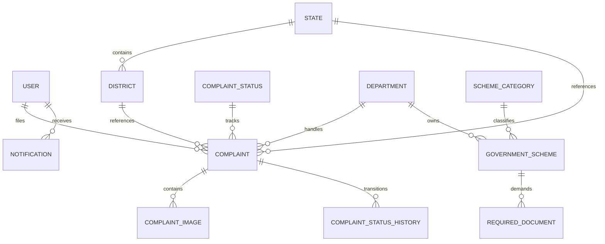

# 🏛️ GovConnect: AI-Powered Government Complaint & Scheme Recommendation Platform

> **Smart India Hackathon (SIH) Project**
> 
> A complete, enterprise-grade citizen portal featuring a modern **React 19 Frontend** and a robust **Django REST Framework Backend** with PostgreSQL, JWT Auth, dynamic Indian locations, automated notification signals, and a personalized welfare schemes recommender.

---

## 📖 Table of Contents
- [Project Overview](#-project-overview)
- [Key Features](#-key-features)
- [Tech Stack](#-tech-stack)
- [Project Structure](#-project-structure)
- [Database Architecture](#-database-architecture)
- [System Architecture](#-system-architecture)
- [API Documentation](#-api-documentation)
- [Installation & Setup](#-installation--setup)
  - [Backend Setup](#1-backend-setup)
  - [Location & Schemes Seeding](#2-seeding-database-locations--schemes)
  - [Frontend Setup](#3-frontend-setup)
- [Docker Support](#-docker-support)
- [Development Guidelines](#-development-guidelines)

---

## 📌 Project Overview
**GovConnect** empowers citizens to bridge the gap between their grievances and administrative resolutions. The platform uses AI to classify complaints, automatically assign them to respective departments, track status history via an interactive timeline, and recommend eligible central/state welfare schemes based on user details and complaint context.

---

## 🔒 Key Features
* **Dual Auth Portal**: Secure JWT authentication supporting traditional Email/Password and OTP-based mobile logins.
* **Dynamic Location Dropdowns**: Dropdowns for Indian states and districts mapped directly to database PKs, ensuring nested district filtering based on the selected state.
* **Smart AI Grievance Assistant**: Conversational AI interface that helps citizens refine descriptions and compiles, reviews, and dispatches email drafts directly to verified local department offices.
* **Inline Image Evidence Embedding**: Dynamic embedding of uploaded citizen evidence photos inline inside the HTML email drafts (using `MIMEImage` Content-IDs) so authorities see photos in the email body flow.
* **Robust Edit & Soft Delete**: Full-featured complaint editing (categories, description, landmarks, map coordinate pinning) and soft-deletion views backed by user-owner permission checks.
* **Automated Notification Signals**: Django `post_save` signals dynamically generate citizen alerts upon complaint submission, reflecting immediately in the frontend notification panel.
* **Welfare Schemes Browser**: Explore government programs filtered by State, Department, and Category, with detailed eligibility, benefits, and required document criteria.
* **Interactive Dashboard**: Modern visualization of complaint resolution statistics, status distribution (Doughnut Chart), and monthly trends (Bar Chart).

---

## 🛠 Tech Stack

### Frontend
* **Core**: React 19, Vite, React Router DOM v6
* **State & Query**: TanStack Query (React Query v5), Context API
* **Styling**: Tailwind CSS v4, Framer Motion (for premium micro-animations)
* **Form & Validation**: React Hook Form, Custom Validator utilities
* **Visualizations**: Chart.js, React-ChartJS-2
* **Feedback**: React Toastify, React Icons (Hi2 & Fi)

### Backend
* **Core Framework**: Django 5.x, Django REST Framework (DRF)
* **Authentication**: JWT via SimpleJWT
* **Database**: PostgreSQL (Dockerized or Local)
* **Filtering & Searches**: django-filter

---

## 📂 Project Structure

```
gov_complaint_schemes/
├── backend/                  # Django REST Framework backend
│   ├── accounts/             # Authentication & user profile management
│   ├── complaints/           # Grievance processing, services, & signals
│   ├── departments/          # Government departments registry
│   ├── categories/           # Complaint categories
│   ├── locations/            # Indian states & districts registry
│   ├── schemes/              # Welfare schemes & required documents
│   ├── backend/              # Core project settings and URL configuration
│   ├── manage.py             # Django entrypoint
│   └── requirements.txt      # Python dependencies
│
├── frontend/                 # Vite + React 19 Frontend
│   ├── src/
│   │   ├── components/       # Layouts, Navbar, Sidebar, Loading elements, MapPicker
│   │   ├── context/          # AuthContext with token refresh logic
│   │   ├── hooks/            # TanStack Queries (useComplaints, useSchemes, useNotifications)
│   │   ├── pages/            # Dashboard, Schemes, Auth, and Complaint Pages (List, Detail, Create, Edit)
│   │   ├── services/         # Axios instance, location & AI API services wrapper
│   │   ├── utils/            # Validators, formatting helpers, and constants
│   │   └── App.jsx           # Router config including /complaints/:id/edit route
│   ├── vite.config.js        # Forwarding rules for /api and /media to Django
│   └── package.json
```

---

## 📊 Database Design



---

## 🔐 API Documentation

### Authentication Endpoints (`/api/auth/`)
* `POST /api/auth/register/` - Create a citizen account.
* `POST /api/auth/login/` - Authenticate via email/phone + password (returns JWT access/refresh tokens).
* `GET /api/auth/profile/` - Fetch authenticated user details.
* `PATCH /api/auth/profile/` - Update profile address, state, district, or phone.
* `POST /api/auth/token/refresh/` - Refresh expired JWT access token.

### Grievances Endpoints (`/api/complaints/`)
* `POST /api/complaints/create/` - Submit a new complaint with categories, departments, and location details.
* `PATCH /api/complaints/{id}/update/` - Update complaint basic data, category, or department classification.
* `DELETE /api/complaints/{id}/delete/` - Soft delete a complaint (sets `is_deleted=True` flag).
* `GET /api/complaints/` - List all active complaints (supports search & filters).
* `GET /api/complaints/my/` - Fetch complaints submitted by the authenticated citizen.
* `GET /api/complaints/{id}/` - Retrieve full complaint metadata, resolution timeline, and attached evidence.
* `POST /api/complaints/{id}/upload-images/` - Upload supporting photos (images are sequentially saved and written to disk).

### AI Grievance Assistant Endpoints (`/api/ai/`)
* `POST /api/ai/chat/` - Chat with Aavedan Saathi AI Assistant (processes user inputs, detects file intent, and retains session state).
* `GET /api/ai/email-preview/` - Get official grievance email plain text body preview, CC addresses, and dynamic attachment lists.
* `POST /api/ai/email-dispatch/` - Send grievance email with inline evidence photos via Central SMTP relay.

### Welfare Schemes Endpoints (`/api/schemes/`)
* `GET /api/schemes/` - Browse welfare schemes (supports search & filters by category, state, and department).
* `GET /api/schemes/{id}/` - View scheme details, benefit description, and required documents.

## 📧 AI Grievance Assistant & Email Dispatch Workflow

The platform features an advanced automated and manual dispatch workflow powered by a stateful conversational AI assistant:

### 1. Manual Classification & Priority Selection
* Citizens can explicitly select the **Category** and **Department** from dropdowns synced directly with backend PostgreSQL databases.
* The AI engine prioritizes manually selected metadata over keyword-extracted inferences to guarantee that citizen preferences are never overwritten.

### 2. Supporting Evidence & Photo Uploads
* Citizen photos uploaded via the frontend are saved sequentially to Django storage disk and linked to the complaint database records.
* During email generation, the system scans for linked records, compiling an inline visual evidence gallery inside the HTML body using Content-IDs (`cid:evidence_X`).
* The visual evidence is attached inline via `MIMEImage` configurations, presenting a professional email layout to authorities.

### 3. Automated Grievance Dispatching
* When dispatch is initiated, the system finds the official verified office contact email based on department, district, and state.
* The draft can be reviewed in a slide-out drawer presenting a live preview of headers, recipients, attachments, and body contents.
* Emails are dispatched using a centralized administrator SMTP routing channel, adding the citizen's email in `Reply-To` and `CC` headers for continuous communication.

---

## 🚀 Installation & Setup

### Prerequisite System Requirements
* Python 3.11+
* Node.js 18+ (npm)
* PostgreSQL (Local database or Docker container)

---

### 1. Backend Setup

Navigate to the backend directory and set up a virtual environment:
```bash
cd backend
python -m venv myenv
```

Activate the environment:
* **Windows**: `myenv\Scripts\activate`
* **Linux/macOS**: `source myenv/bin/activate`

Install dependencies:
```bash
pip install -r requirements.txt
```

Create a `.env` file in the `backend/` folder:
```env
SECRET_KEY=your_production_secret_key
DEBUG=True
DB_NAME=gov_complaint_db
DB_USER=postgres
DB_PASSWORD=your_password
DB_HOST=localhost
DB_PORT=5432
```

Run database migrations:
```bash
python manage.py makemigrations
python manage.py migrate
```

---

### 2. Seeding Database (Locations & Schemes)

The database includes a default seed command as well as custom scripts targeting Smart India Hackathon location datasets.

**Seed Core Metadata (Departments, Statuses, Base Categories)**:
```bash
python manage.py seed_data
```

**Seed Complete Indian States & District Lists** (Seeds all 30 districts of Odisha, all 24 districts of Jharkhand, all 38 districts of Bihar, and major districts for other states):
```bash
python seed_locations.py
```

**Seed Government Welfare Schemes & Requirements**:
```bash
python seed_schemes.py
```

Create a superuser to access the Django Administration Dashboard (`/admin`):
```bash
python manage.py createsuperuser
```

Run the development server:
```bash
python manage.py runserver
```
The API backend will boot up at `http://127.0.0.1:8000/`.

---

### 3. Frontend Setup

Navigate to the frontend directory:
```bash
cd ../frontend
```

Install dependencies:
```bash
npm install
```

Start the Vite React development server:
```bash
npm run dev
```
The React citizen portal will boot up at `http://localhost:5173/`. 

*(Vite configuration includes a proxy mapping `/api` requests automatically to the backend at `http://127.0.0.1:8000` to prevent CORS issues).*

---

## 🐳 Docker Support

You can spin up a dedicated local PostgreSQL database using Docker Compose:
```bash
# Start container in detached background mode
docker compose up -d

# Verify postgres container is running
docker ps

# Tear down container
docker compose down
```

---

## 💻 Development Guidelines
* **Service Layer Pattern**: Keep all core business logic inside `services.py` layers. Views should focus purely on deserializing request inputs and returning API response maps.
* **Circular Import Safety**: Import models inside method definitions (local scope) where cross-referencing occurs (e.g. referencing `Notification` inside `Complaint` signal hooks).
* **React Rendering**: Always safeguard nested JSON objects from the API when rendering directly inside JSX (e.g. using `{scheme.department?.name || scheme.department}` to prevent DOM representation exceptions).
